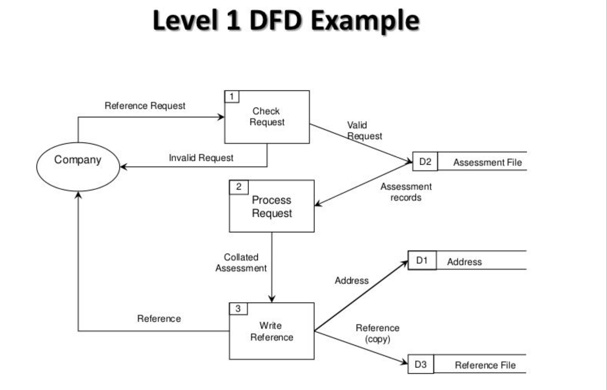

# SRS - Software Requirement Specification
- Defines what the system must do
- Describes functionality of system
- identifies look and feel of system

# Definitions
- **System:** Set of components acting together to perform a task
- **Boundary** Identifies what considered part of system, what considered external; provides location for system in big pic
- **Ent/Obj** Entities & Obj are elem in sys that can take state or value
- **Activities** actions resulting in change of state or value
- **Use Case** Sequence of actions a system perform that yields an observable result of value to a particular actor

- **Actor** an entity outside system that is involved in interacting with system
- **Scenario** A single path through use case
- **Use Case Diagram** Graphical representation showing the relationship between a set of use cases and the involved actors. **Purpose** structured approach to show requirements, capture functions and show user interaction for each goal
- **Data Flow Diagram** Graphical tool to show flow of data in a system. Used to show where data comes from, where it goes & what transformations happen to it in process.

- **Software Quality** is whether a product meets the specifications, as well as customers requirements **achieved** through testing including code review, unit testing, integration testing & end to end testing

# System Architecture
- The Repository Model  (adelaide metro) 
  - good at managing large data
  - subsystems connected to a database 
- The Client/Server Model
  - access video, text, data
  - networks/client/server (netflix) 
- The Abstract Machine Model
  - like an onion, deals with high level 
  - complex systems (spaceship).

# Control Models
- **Centralised Control:** One subsystem has overall responsibility for control, stars / stops other components
  - **Call and Return Model**
    - Top down approach
    - passes down permission from main routine
    - Sequential systems
  - **Manager Model**
    - has a core system controller that reference system state variables. 
    - Polling sensors
- **Event Based Control:** Each subsystem responds to externally generated events
  - **Interrupt driven handler**
    - high performance hard to upgrade -hardware based - limited switches -complex to program and manage 
  - **Broadcast model**
    - has a single stream of events
    - subsystems don't know if events are handled- easy to upgrade

# Requirements
- **Functional:** Relates to technical aspects of system  - Create a new user, need username pass, returns id
- **Non-Functional:** Can be used to determine the success of system - System must respond to events in 5 seconds under no load

# Constraints
- **Implementation:** Constraints that must be observed when implementing the system such as no downtime
- **Design:** Imposed by others, influence the design - software must run on centos

# Maintenance
- **Maintenance** is any work done after the system is operational
  - **Corrective** fix any newly discovered bugs
  - **Preventative** is to improve the system for future maintainability and reliability
  - **Adaptive** Changes in the environment of a software system (e.g., hardware or operating system upgrades) will necessitate changes in the system; the software will have to be modified so that it continues to function in the new environment.
  - **Perfective** As a software system is used, the users suggest new capabilities and other changes to improve the system 
 - **Side Effects**
   - **Documentation** - changes when source code is updated but relevant docs are not
   - **Coding** - when source code is updated but not all references to a particular function have been checked
   - **Data** - modify individual elements of data structures / alter the structure in a way that is no longer compatible with the software the system is using
- **Improve** by improving code quality through code review, ensuring features are well documented

# Testing
- **Validation** is checking that the requirements define the system that the consumer wants
- **Verification** is checking that requirement statements are accurate, complete and unambiguous
- **White-box Testing**
  - General Purpose  Examines a method of testing software that tests the inner workings of a function
- **Black-box Testing**
    - General Purpose  Examines the functionality of an application without peering into its internals structures or workings.
- **Stages** Can be broken down into three many stages
  - **Unit Testing** to test each individual module does what the designer intended
  - **Integration Testing** to test the interface between each module is as intended
  - **System Testing** to make sure the system does what the customer intended

# Life Cycle
